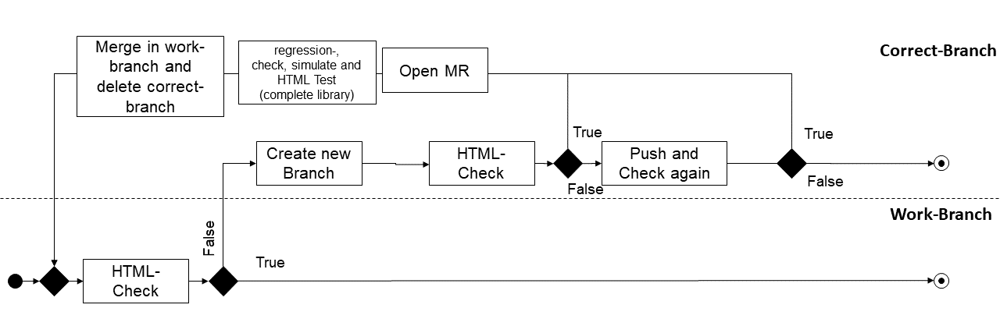

# What is it?
These tests validate the html syntax or the dymola style.

## html_tidy_errors.py
The Test html_tidy_errors.py validate and correct the HTML code. 
Return a log file.
#### Parser Arguments
| Parser Arguments  | Description      | 
|-------------------| ------------------------- | 
| --correct-overwrite  |correct html code in modelica files and overwrite old files.|
| --correct-backup  | backup old files.|
| --single-package  | Package tested for correct html syntax.|
| --log | create logfile of model with errors.|
| --path  | Path where top-level package.mo of the library is located.|
| --whitelist | Create a new whitelist for a Library.|
| --correct-view  | Check and print the Correct HTML Code.|
| --library  | library tested for correct html syntax.|
| --wh-library | library tested for correct html syntax.|
| --git-url  | Url repository of a library for which a whitelist is written.|
| --filter-whitelist | Argument that models on the whitelist are not tested (default: True).|

#### Example: Execution on gitlab runner (linux)
    python Dymola_python_tests/CITests/SyntaxTests/html_tidy_errors.py --s AixLib --correct-view --log  --filter-whitelist
    python Dymola_python_tests/CITests/SyntaxTests/html_tidy_errors.py --s AixLib --correct-overwrite --filter-whitelist --log
    python Dymola_python_tests/CITests/SyntaxTests/html_tidy_errors.py --whitelist --git-url https://github.com/ibpsa/modelica-ibpsa.git --wh-library IBPSA

For more information look at following [Repository](https://github.com/RWTH-EBC/HTML-Tidy-Modelica).

For the implementation in gitlab-yaml go to the following [link](https://git.rwth-aachen.de/EBC/EBC_all/gitlab_ci/templates/-/tree/AixLib/dymola-ci-tests/ci_templates)
## StyleChecking.py
StyleChecking use the *ModelManagement* library in dymola. The script tests the syntax of models or library. 
Return a log file. 
#### Parser Arguments
| Parser Arguments  | Description      | 
|-------------------| ------------------------- | 
| --single-package  | Name of the package to test.|
| --library         | Name of the library to test.|
| --dymola-version  | Number of dymola-version (e.g. 2022, depends on dymola image). |
| --changed-models  | Check only changed models with last commit push (in CI: ci_changed_model_list.txt)|

#### Example: Execution on gitlab runner (linux)
    xvfb-run -n 77 python Dymola_python_tests/CITests/SyntaxTests/StyleChecking.py -s AixLib -p AixLib/package.mo -DS 2022
    xvfb-run -n 77 python Dymola_python_tests/CITests/SyntaxTests/StyleChecking.py -s AixLib -p AixLib/package.mo -CM -DS 2022

For the implementation in gitlab-yaml go to the following [link](https://git.rwth-aachen.de/EBC/EBC_all/gitlab_ci/templates/-/tree/AixLib/dymola-ci-tests/ci_templates)

